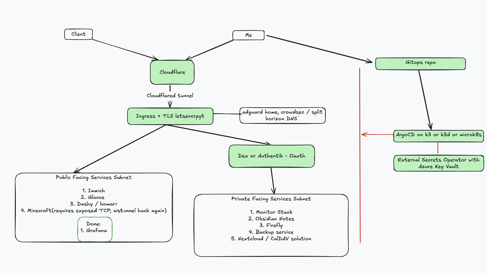

# homelab-argo

# Goals:

1. Use argocd for tunnel/ssh-free configurations
2. I will be reliant on monitoring / argocd dashboard
3. Single node k8s cluster? microk8s/k3s/k3d?
4. Auth (properly configured)
5. Fail2ban, other nice security features
6. public vs private subnet segregation
7. Image updaters
8. External Secrets

# Diagram: 


# k3d:
```
k3d cluster create homelab --config k3d-config.yaml 
tilt up --host 0.0.0.0
cloudflared tunnel --config debug-tunnel/debug-tunnel.yml run
```

ip is 192.168.0.198